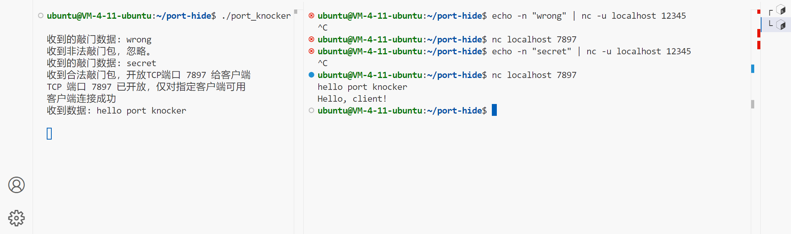
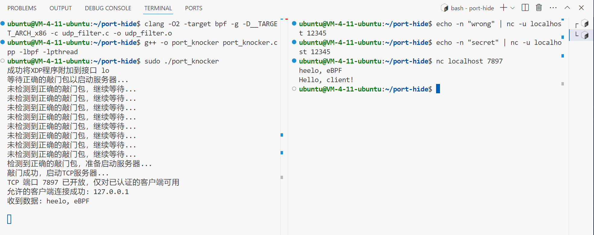

# port-hide
“端口隐藏”实现demo

## 开发过程

### v1.0

考虑到对网络编程不是特别熟悉，所以第一版先能跑通最重要：）

根据端口隐藏的概念，设计了一个简单的程序，实现大致流程如下：
1. 启动UDP监听器，等待敲门数据包。
2. 当接收到正确的敲门数据包后，启动TCP服务器并开放指定端口。
3. 仅允许发送了正确敲门包的客户端连接到TCP服务器。
4. 在TCP连接建立后，处理客户端请求并返回响应信息。

#### 使用方法

打开服务器终端
```
git clone <this_repository_url>
cd port-hide
g++ -std=c++11 port_knocker.cpp -o port_knocker -pthread
./port_knocker
```

另外开一个终端
```
echo -n "secret" | nc -u localhost 12345
nc localhost 7897

# 然后输入你想传入的内容回车
# 就能在上一个终端看到数据接收成功的状态
```

效果图


### v2.0

这个版本主要是为了用eBPF实现了UDP过滤器，eBPF是能够可以直接在内核中运行程序，通过XDP能够直接在网卡驱动程序收到数据包时就进行处理，因此具有很好的性能。

在看eBPF相关资料时看到了Brendan Gregg这个眼熟的名字，又想起了去年在前司调优数据库性能的参考他的性能观察工具图的痛苦日子。

在调试这个eBPF的过程中因为内核版本较低，吃了很多亏。有些eBPF的指令在Linux内核版本较低(好像是小于5.5)时是不支持的，bpftool好像也用不了，建议写eBPF不要选Ubuntu20.04（

在写udp_filter.c过程中想当然的用了XDP_DROP，然后运行时发现我的ssh连接怎么挂了？？？难道写的代码把服务器写崩了？看腾讯云发现一切运行良好。排查半天（重启服务器十次...）才想明白原来是把所有不匹配包全DROP了，同时把SSH的连接也断了...这个故事告诉我们写eBPF要小心（权限很大）

调试半天最后终于顺利跑通了。实现了用eBPF实现端口敲门机制，具体细节如下
- 添加了eBPF程序附加到指定网络接口以进行数据包过滤
- 实现了一个端口敲门机制，只允许经过认证的客户端连接
- 使用eBPF映射存储和验证允许的客户端IP
- 集成一个监听指定端口的TCP服务器并处理客户端连接
- 通过确保只有具有正确敲门序列的客户端才能访问服务器来增强安全性

#### 使用方法

打开服务器终端
```
git clone <this_repository_url>
cd port-hide
clang -O2 -target bpf -g -D__TARGET_ARCH_x86 -c udp_filter.c -o udp_filter.o
g++ -o port_knocker port_knocker.cpp -lbpf -lpthread
# eBPF程序需要足够的权限
sudo ./port_knocker
```

另外开一个终端
```
echo -n "secret" | nc -u localhost 12345
nc localhost 7897

# 然后输入你想传入的内容回车
# 就能在上一个终端看到数据接收成功的状态
```

效果图


## 参考学习资料

[YouTube@Eric O Meehan -- Creating a Web Server from Scratch in C](https://www.youtube.com/watch?v=gk6NL1pZi1M)

[YouTube@Nicholas Day -- C++ Network Programming Part 1: Sockets ](https://www.youtube.com/watch?v=gntyAFoZp-E)

[Wiki: Port knocking](https://en.wikipedia.org/wiki/Port_knocking)

[Jack Huang: C++高性能网络编程](https://huangwang.github.io/2019/10/26/CPlusPlus%E9%AB%98%E6%80%A7%E8%83%BD%E7%BD%91%E7%BB%9C%E7%BC%96%E7%A8%8B/)

... 
// 看eBPF这部分有一大堆，考虑篇幅还是不全列出了